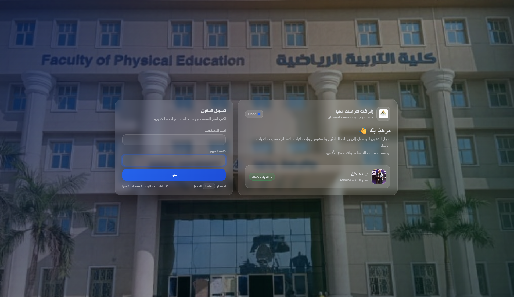

# Postgraduate Supervision Management System

A Django and MySQL web application for managing postgraduate research supervision records.

The system helps organize researchers, thesis or research titles, departments, supervisors, supervision status, and important academic approval dates. It also supports importing supervision data from Excel files, including cases where the same researcher appears in multiple rows because they have multiple supervisors.

## Features

- Manage researchers and thesis/research records
- Assign one or more supervisors to each researcher
- Track supervision status
- Store important academic dates:
  - Registration date
  - Framework approval date
  - University approval date
- Import supervision records from Excel files
- Handle repeated researcher rows when multiple supervisors exist
- Manage data through Django Admin
- MySQL database support
- Environment-based configuration using `.env`

## Tech Stack

- Python
- Django
- MySQL
- HTML / CSS
- Pandas
- OpenPyXL
- Django Admin

## Screenshots

### Login Page



## Project Structure

```text
supervision-system/
├── config/
├── core/
├── manage.py
├── requirements.txt
├── .env.example
└── README.md
```

## Getting Started

### 1. Create MySQL Database

```sql
CREATE DATABASE supervision_db CHARACTER SET utf8mb4 COLLATE utf8mb4_unicode_ci;
```

### 2. Create Environment File

Copy `.env.example` to `.env` and update your database settings:

```env
DJANGO_SECRET_KEY=change-me
DJANGO_DEBUG=1

DB_NAME=supervision_db
DB_USER=root
DB_PASSWORD=YOUR_PASSWORD
DB_HOST=127.0.0.1
DB_PORT=3306
```

### 3. Create Virtual Environment

```bash
python -m venv venv
```

Activate it:

```bash
# Windows
venv\Scripts\activate

# Linux / macOS
source venv/bin/activate
```

### 4. Install Dependencies

```bash
pip install -r requirements.txt
```

### 5. Run Migrations

```bash
python manage.py migrate
```

### 6. Create Admin User

```bash
python manage.py createsuperuser
```

### 7. Run the Server

```bash
python manage.py runserver
```

Open the admin panel:

```text
http://127.0.0.1:8000/admin
```

## Excel Import

The system supports importing supervision data from Excel files.

It can handle cases where a researcher appears in multiple rows because each row contains a different supervisor.

Basic usage:

```bash
python manage.py import_supervisions path/to/your_file.xlsx
```

If your Excel column names are different, you can pass custom column names:

```bash
python manage.py import_supervisions data.xlsx \
  --col_degree "المرحلة" \
  --col_name "اسم الباحث" \
  --col_dept "القسم" \
  --col_title "عنوان الرسالة" \
  --col_supervisor "المشرف"
```

## Important Date Fields

The `Research` model includes the following optional date fields:

- `registration_date`
- `frame_date`
- `university_approval_date`

These fields are left empty during Excel import and can be updated later from the admin dashboard.

## Security Notes

- Do not commit `.env` to GitHub.
- Do not upload real student, researcher, or supervisor data to a public repository.
- Use fake sample data if you want to demonstrate the Excel import feature.
- Remove real Excel files, exported user fixtures, and password hashes before making the repository public.

## Future Improvements

- Add a custom dashboard instead of relying only on Django Admin
- Add search and filtering pages for researchers and supervisors
- Add role-based access for departments
- Export reports to Excel or PDF
- Add charts for supervision statistics
